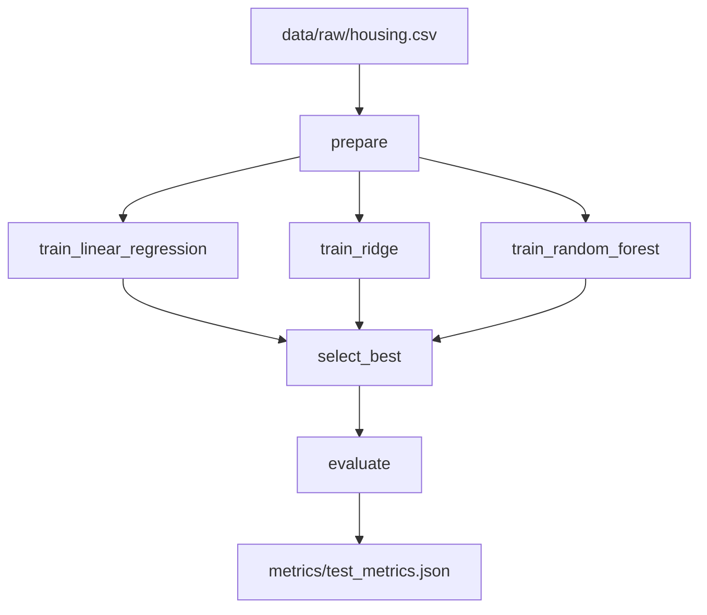

# ML-пайплайн

## Архитектура

Пайплайн из 6 стадий, определённый в `dvc.yaml` и запускаемый через DVC:



---

## Стадии

### Stage 1: prepare

**Скрипт:** `scripts/prepare.py`

Загружает сырые данные и делит на обучающую/тестовую выборки.

| | |
|---|---|
| **Входные данные** | `data/raw/housing.csv` |
| **Параметры** | `prepare.test_size`, `prepare.random_state` |
| **Выходные данные** | `data/processed/train.csv`, `data/processed/test.csv` |

```bash
poetry run python scripts/prepare.py
```

---

### Stages 2–4: train_{model}

**Скрипт:** `scripts/train.py`

Обучает одну модель, вычисляет train/val метрики, логирует в MLflow (и ClearML, если включён).

| | |
|---|---|
| **Входные данные** | `data/processed/train.csv` |
| **Параметры** | `train.random_state`, `train.val_size`, `model.*` |
| **Выходные данные** | `models/{model_name}.joblib` |
| **Метрики** | `metrics/train_{model_name}.json` |

Логируемые метрики:

- `train_rmse`, `train_mae`, `train_r2`
- `val_rmse`, `val_mae`, `val_r2`

```bash
# Обучить конкретную модель
poetry run python scripts/train.py model=ridge

# С Hydra CLI-оверрайдом
poetry run python scripts/train.py model=random_forest model.params.n_estimators=200
```

---

### Stage 5: select_best

**Скрипт:** `scripts/select_best.py`

Сравнивает все 3 модели по `val_rmse`, выбирает лучшую.

| | |
|---|---|
| **Входные данные** | 3 файла `models/*.joblib` + 3 файла `metrics/train_*.json` |
| **Выходные данные** | `models/best_model.joblib`, `metrics/train_metrics.json` |

`train_metrics.json` содержит:

```json
{
  "best_model": "random_forest",
  "best_val_rmse": 3.776,
  "all_models": {
    "linear_regression": {"val_rmse": 4.826, ...},
    "ridge": {"val_rmse": 4.825, ...},
    "random_forest": {"val_rmse": 3.776, ...}
  }
}
```

---

### Stage 6: evaluate

**Скрипт:** `scripts/evaluate.py`

Оценивает лучшую модель на тестовой выборке.

| | |
|---|---|
| **Входные данные** | `models/best_model.joblib`, `data/processed/test.csv` |
| **Выходные данные** | `metrics/test_metrics.json` |

```json
{
  "rmse": 3.449,
  "mae": 2.269,
  "r2": 0.838
}
```

---

## Конфигурация (Hydra)

Конфигурация строится из файлов:

```
conf/
├── pipeline.yaml          # корневой конфиг
└── model/
    ├── linear_regression.yaml
    ├── ridge.yaml
    └── random_forest.yaml
```

Пример `conf/pipeline.yaml` (фрагмент):

```yaml
defaults:
  - _self_
  - model: linear_regression

prepare:
  test_size: 0.2
  random_state: 42

train:
  random_state: 42
  val_size: 0.2

mlflow:
  tracking_uri: sqlite:///mlflow.db
  experiment_name: boston-housing

clearml:
  enabled: false
  project_name: boston-housing-hw5
```

---

## Мониторинг

Каждая стадия оборачивается контекстным менеджером `monitored_stage` из `src/housing/pipeline/monitoring.py`:

- Фиксирует время начала/конца
- Логирует статус (success/error)
- Пишет события в `metrics/pipeline_events.jsonl`
- Отправляет уведомления (консоль / файл)

Формат события:

```json
{
  "stage": "train",
  "status": "success",
  "started_at": "2024-01-15T10:00:00",
  "finished_at": "2024-01-15T10:00:05",
  "duration_sec": 5.3
}
```

---

## Feature Engineering

Пайплайн признаков (`src/housing/features/build.py`):

1. **StandardScaler** - стандартизация всех 13 числовых признаков

Признаки датасета Boston Housing:

| Признак | Описание |
|---|---|
| `crim` | Уровень преступности на душу населения |
| `zn` | Доля жилой зоны под крупные участки |
| `indus` | Доля нежилых коммерческих земель |
| `chas` | Фиктивная переменная (рядом с рекой Чарльз) |
| `nox` | Концентрация оксидов азота |
| `rm` | Среднее количество комнат |
| `age` | Доля построенных до 1940 г. домов |
| `dis` | Расстояние до центров занятости |
| `rad` | Индекс доступности автомагистралей |
| `tax` | Ставка налога на имущество |
| `ptratio` | Соотношение учеников/учителей |
| `b` | Доля афроамериканского населения |
| `lstat` | % населения с низким статусом |
| `medv` | **Таргет**: медианная стоимость жилья (тыс. $) |
