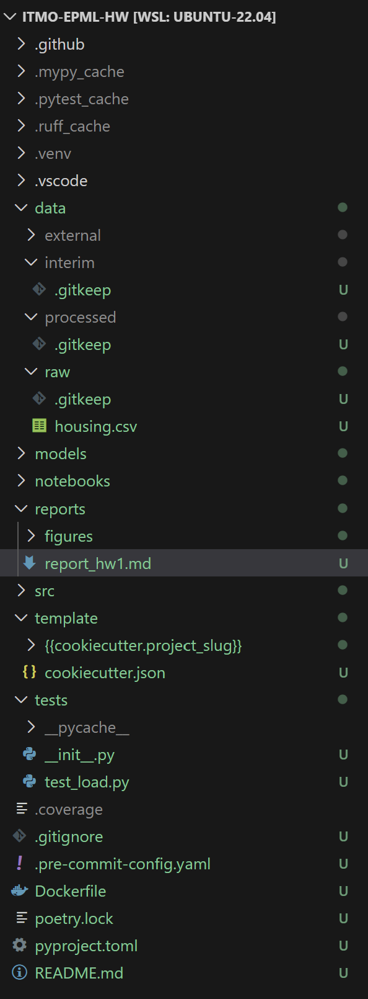
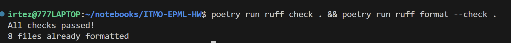
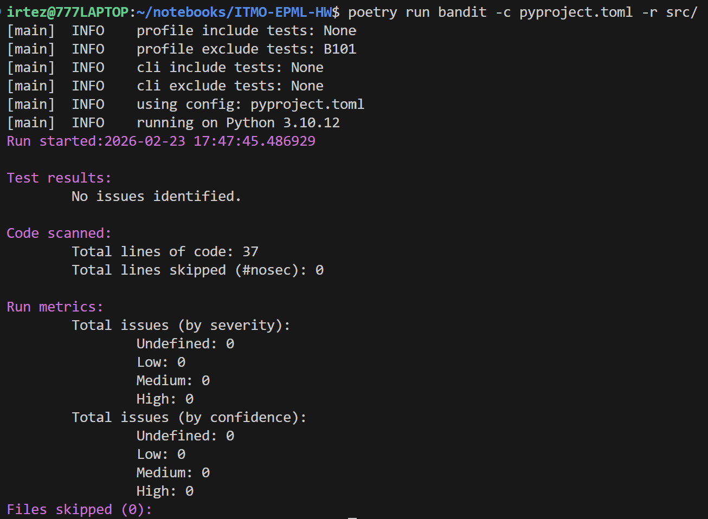
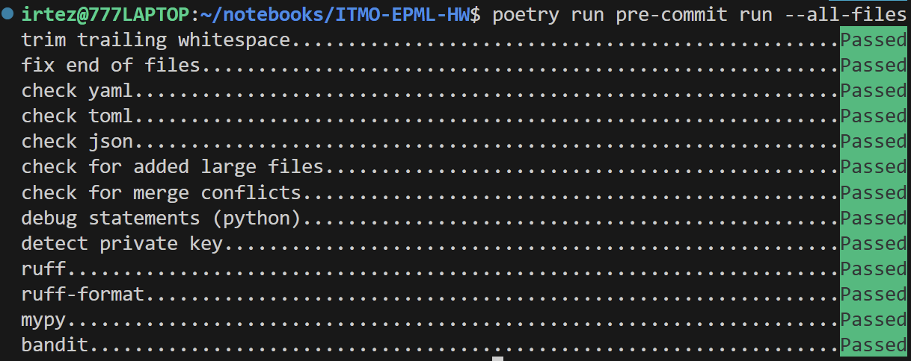
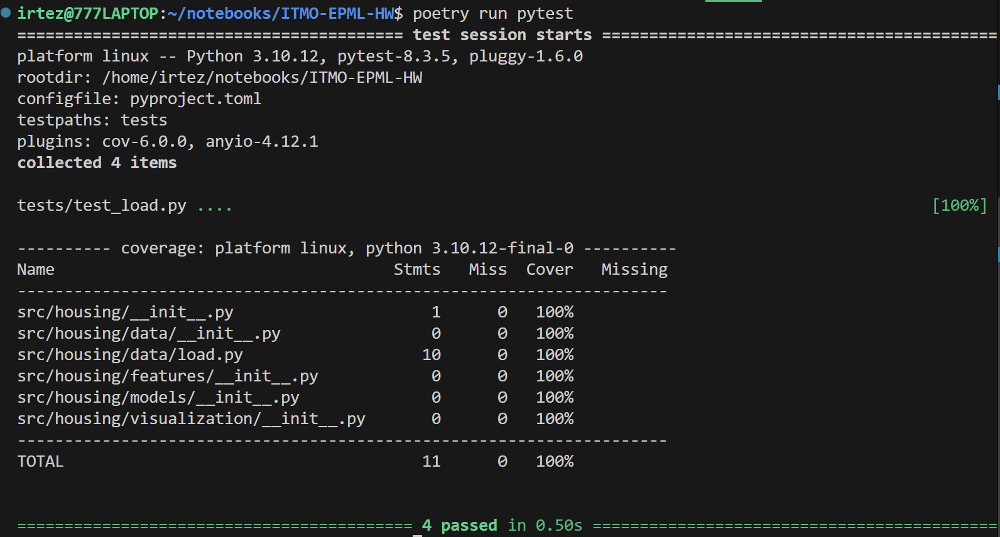

# Отчёт по Домашнему Заданию 1: Настройка DS-репозитория

## Содержание
1. [Структура проекта](#1-структура-проекта)
2. [Качество кода](#2-качество-кода)
3. [Управление зависимостями](#3-управление-зависимостями)
4. [Git workflow](#4-git-workflow)
5. [Инструкция по воспроизведению](#5-инструкция-по-воспроизведению)

---

## 1. Структура проекта

### Инструмент: Cookiecutter

**Зачем нужен:** Cookiecutter - это инструмент для создания проектов из шаблонов. Вместо того чтобы каждый раз вручную создавать одни и те же папки и файлы, достаточно один раз написать шаблон и использовать его для генерации новых проектов командой `cookiecutter <шаблон>`.

**Что сделано:** Структура папок следует стандарту [Cookiecutter Data Science](https://cookiecutter-data-science.drivendata.org/). В директории `template/` хранится готовый Cookiecutter-шаблон, который можно использовать для старта новых DS-проектов.

### Структура репозитория

```
ITMO-EPML-HW/
├── data/
│   ├── raw/            # Исходные данные - не изменяются
│   ├── interim/        # Промежуточные данные после обработки
│   ├── processed/      # Финальные данные для моделирования
│   └── external/       # Внешние данные из сторонних источников
├── models/             # Сохранённые обученные модели
├── notebooks/          # Jupyter-ноутбуки для EDA и экспериментов
├── reports/
│   └── figures/        # Сгенерированные графики
├── src/
│   └── housing/        # Устанавливаемый Python-пакет
│       ├── data/       # Загрузка и очистка данных
│       ├── features/   # Инженерия признаков
│       ├── models/     # Обучение и оценка моделей
│       └── visualization/
├── template/           # Cookiecutter-шаблон для новых DS-проектов
│   ├── cookiecutter.json
│   └── {{cookiecutter.project_slug}}/
├── tests/              # Тесты (pytest)
├── .gitignore
├── .pre-commit-config.yaml
├── Dockerfile
├── poetry.lock
├── pyproject.toml
└── README.md
```

**Принцип организации данных:** папки `data/interim/`, `data/processed/`, `data/external/` содержат только `.gitkeep` (чтобы Git хранил структуру папок), а сами файлы данных в них не коммитятся.

### Датасет

`data/raw/housing.csv` - Boston Housing Dataset. Содержит характеристики жилых кварталов Бостона: уровень преступности, количество комнат, налоговую ставку и т.д. Целевая переменная - `medv` (медианная стоимость домов).

### README

Файл `README.md` описывает проект, структуру директорий, датасет и команды для работы с проектом.

### Скриншот структуры файлов



---

## 2. Качество кода

### Инструмент: Ruff

**Зачем нужен:** Ruff - это очень быстрый линтер и форматировщик кода на Python, написанный на Rust. Он заменяет сразу три инструмента:
- **Black** - форматирование кода (единый стиль отступов, кавычек, длины строк)
- **isort** - сортировка импортов в алфавитном порядке
- **Flake8** - проверка стиля кода по PEP 8

Конфигурация находится в `pyproject.toml` в секции `[tool.ruff]`.

```toml
[tool.ruff]
target-version = "py310"
line-length = 88
exclude = ["template/"]

[tool.ruff.lint]
select = [
    "E",   # pycodestyle errors
    "W",   # pycodestyle warnings
    "F",   # pyflakes
    "I",   # isort
    "B",   # flake8-bugbear
    "C4",  # flake8-comprehensions
    "UP",  # pyupgrade
    "S",   # flake8-bandit (security)
    "N",   # pep8-naming
]
```

**Результат:**



---

### Инструмент: MyPy

**Зачем нужен:** MyPy - статический анализатор типов. Он проверяет аннотации типов в коде ещё до запуска программы, что помогает поймать целый класс ошибок на этапе разработки (например, передача строки туда, где ожидается число).

Конфигурация в `pyproject.toml`:

```toml
[tool.mypy]
python_version = "3.10"
strict = true
ignore_missing_imports = true
exclude = ["notebooks/", "template/"]
```

**Результат:**


---

### Инструмент: Bandit

**Зачем нужен:** Bandit - это линтер для поиска уязвимостей безопасности в Python-коде. Он проверяет код на наличие типичных проблем: SQL-инъекции, использование небезопасных функций (`eval`, `exec`), жёстко прописанные пароли и т.д.

Конфигурация в `pyproject.toml`:

```toml
[tool.bandit]
exclude_dirs = ["tests", "notebooks", "template"]
skips = ["B101"]  # разрешаем assert в тестах
```

**Результат:**



---

### Инструмент: pre-commit

**Зачем нужен:** pre-commit - это фреймворк для запуска проверок автоматически перед каждым `git commit`. Если хотя бы одна проверка не прошла - коммит блокируется. Это гарантирует, что в репозиторий никогда не попадёт некорректно отформатированный или небезопасный код.

Конфигурация в `.pre-commit-config.yaml`:

```yaml
repos:
  - repo: https://github.com/pre-commit/pre-commit-hooks   # базовые проверки
  - repo: https://github.com/astral-sh/ruff-pre-commit     # Ruff (lint + format)
  - repo: https://github.com/pre-commit/mirrors-mypy       # MyPy
  - repo: https://github.com/PyCQA/bandit                  # Bandit
```

Подключённые базовые хуки:
- `trailing-whitespace` - удаление пробелов в конце строк
- `end-of-file-fixer` - добавление переноса в конце файла
- `check-yaml`, `check-toml`, `check-json` - проверка синтаксиса конфигов
- `check-added-large-files` - блокировка файлов > 10 МБ
- `detect-private-key` - предотвращение коммита секретных ключей
- `debug-statements` - обнаружение забытых `breakpoint()` / `pdb`

**Результат:**



---

### Тесты

Для проверки базового функционала настроен **pytest** с измерением покрытия кода (**pytest-cov**).

**Результат:**



---

## 3. Управление зависимостями

### Инструмент: Poetry

**Зачем нужен:** Poetry - это менеджер зависимостей и пакетов для Python. Он решает сразу несколько задач:
- Хранит все зависимости в одном файле `pyproject.toml`
- Автоматически создаёт и управляет виртуальным окружением
- Генерирует `poetry.lock` с точными (до патч-версии) версиями всех зависимостей, включая транзитивные - это гарантирует 100% воспроизводимость окружения на любой машине

### pyproject.toml

Единый конфигурационный файл для всего проекта. Содержит:
- Метаданные пакета (`name`, `version`, `description`)
- Зависимости runtime и dev
- Конфигурацию всех инструментов (Ruff, MyPy, Bandit, pytest, coverage)

Зависимости разделены на две группы:

| Группа | Пакеты | Назначение |
|--------|--------|-----------|
| `[tool.poetry.dependencies]` | pandas, numpy, scikit-learn, matplotlib, seaborn, jupyter | Runtime: нужны для работы проекта |
| `[tool.poetry.group.dev.dependencies]` | ruff, mypy, bandit, pre-commit, pytest, pytest-cov | Dev: нужны только при разработке |

### Виртуальное окружение

Poetry создаёт виртуальное окружение автоматически в папке `.venv/` внутри проекта (настройка `virtualenvs.in-project = true`). Это означает, что окружение изолировано и видно прямо в VS Code.

### Dockerfile

**Зачем нужен:** Docker позволяет упаковать проект и его окружение в контейнер, который запускается одинаково на любой машине - независимо от операционной системы и установленных пакетов.

Dockerfile использует двухэтапную сборку:

1. **Builder stage** - устанавливает Poetry и зависимости
2. **Runtime stage** - копирует только готовый `.venv/` и код, без лишних инструментов сборки

Дополнительно настроено:
- Запуск от имени непривилегированного пользователя (`appuser`) - лучшая практика безопасности
- `PYTHONDONTWRITEBYTECODE=1` - не создавать `.pyc` файлы в контейнере
- `PYTHONUNBUFFERED=1` - вывод логов без буферизации

---

## 4. Git workflow

### .gitignore

`.gitignore` содержит правила для ML-проекта:

| Что игнорируется | Почему |
|-----------------|--------|
| `.venv/` | Виртуальное окружение воспроизводится через `poetry install` |
| `data/interim/*`, `data/processed/*` | Промежуточные данные - воспроизводимы скриптами |
| `models/*.pkl`, `*.joblib` | Большие бинарные файлы моделей |
| `.mypy_cache/`, `.ruff_cache/`, `.pytest_cache/` | Кеши инструментов |
| `.env`, `.env.*` | Секреты и переменные окружения |
| `__pycache__/`, `*.pyc` | Скомпилированные файлы Python |

При этом `.gitkeep` файлы в `data/interim/`, `data/processed/`, `data/external/` **коммитятся** - чтобы структура папок присутствовала в репозитории после клонирования.

---

### Ветки

Репозиторий использует стратегию **branch-per-homework**:

| Ветка | Назначение |
|-------|-----------|
| `master` | Стабильная ветка: содержит только завершённые и сданные ДЗ |
| `hw/hw1` | Ветка ДЗ1 (указывает на тот же коммит, что `master`) |
| `hw/hwN` | Рабочая ветка каждого нового ДЗ, создаётся от `master` |

**Workflow для нового ДЗ:**

```bash
# Создать ветку для нового ДЗ
git checkout -b hw/hw2 master

# ... работа, коммиты ...

# После завершения — влить в master
git checkout master
git merge --no-ff hw/hw2 -m "feat: homework 2 — <тема>"
```

Флаг `--no-ff` (no fast-forward) создаёт явный merge-коммит, что делает границу каждого ДЗ хорошо видимой в `git log`.

---

## 5. Инструкция по воспроизведению

### Требования

- Python 3.10+
- [Poetry](https://python-poetry.org/docs/#installation): `curl -sSL https://install.python-poetry.org | python3 -`
- Git

### Шаги

```bash
# 1. Клонировать репозиторий
git clone <repo-url>
cd ITMO-EPML-HW

# 2. Настроить Poetry (создать .venv внутри проекта)
poetry config virtualenvs.in-project true

# 3. Установить все зависимости (точные версии из poetry.lock)
poetry install

# 4. Установить pre-commit хуки (один раз)
poetry run pre-commit install

# 5. Убедиться, что все проверки проходят
poetry run pre-commit run --all-files

# 6. Запустить тесты
poetry run pytest
```

### Проверка инструментов вручную

```bash
# Форматирование и линтинг кода
poetry run ruff format .
poetry run ruff check . --fix

# Проверка типов
poetry run mypy src/

# Проверка безопасности
poetry run bandit -c pyproject.toml -r src/
```

### Docker

```bash
# Сборка образа
docker build -t housing .

# Запуск контейнера
docker run --rm housing
```

### Создать новый DS-проект из шаблона

```bash
# Установить cookiecutter (если не установлен)
pip install cookiecutter

# Сгенерировать новый проект
cookiecutter template/
```
