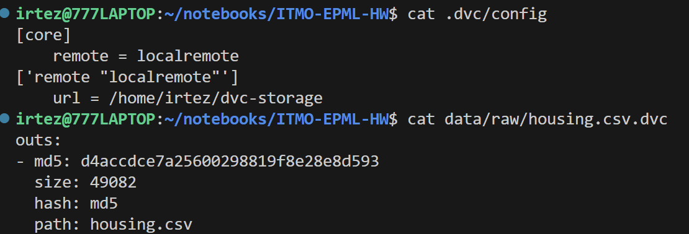
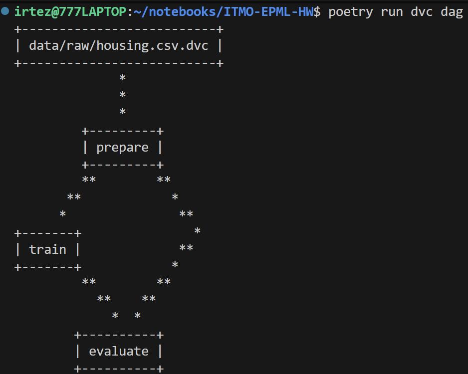
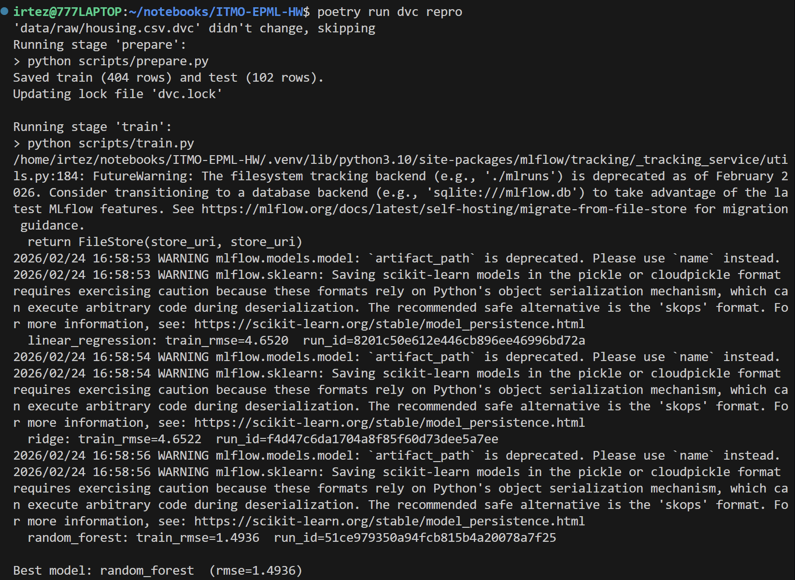
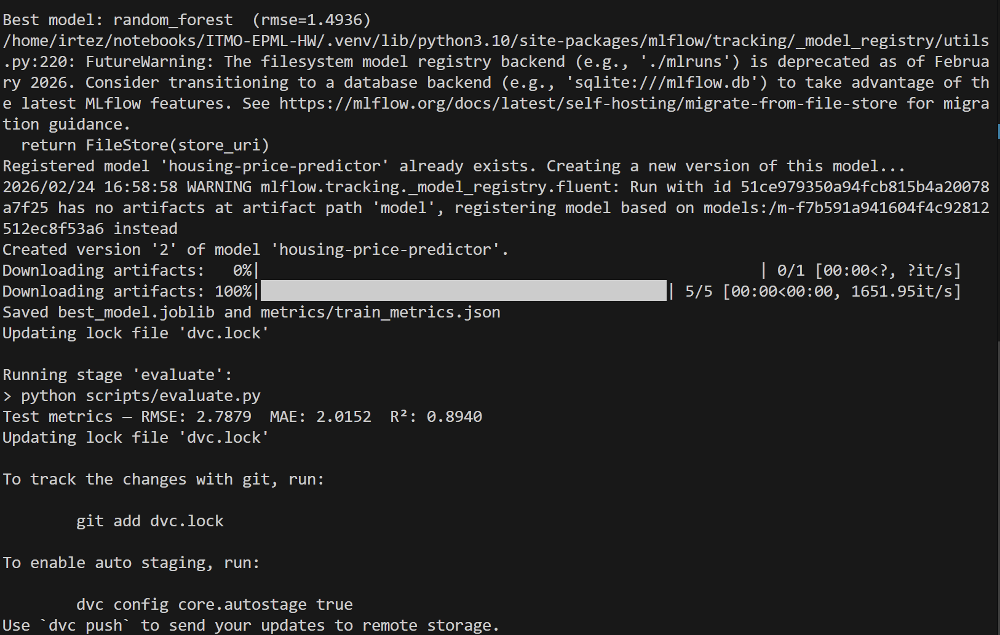
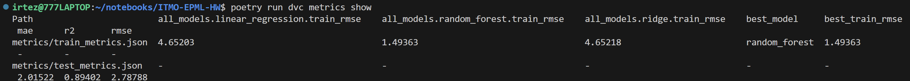
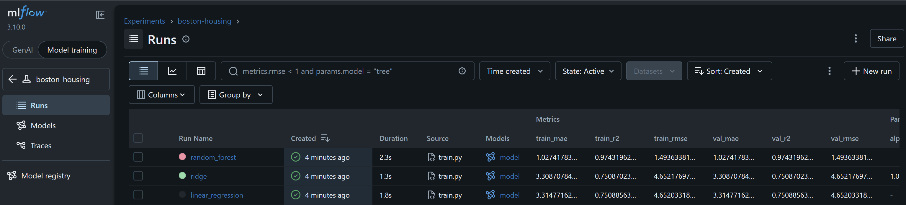
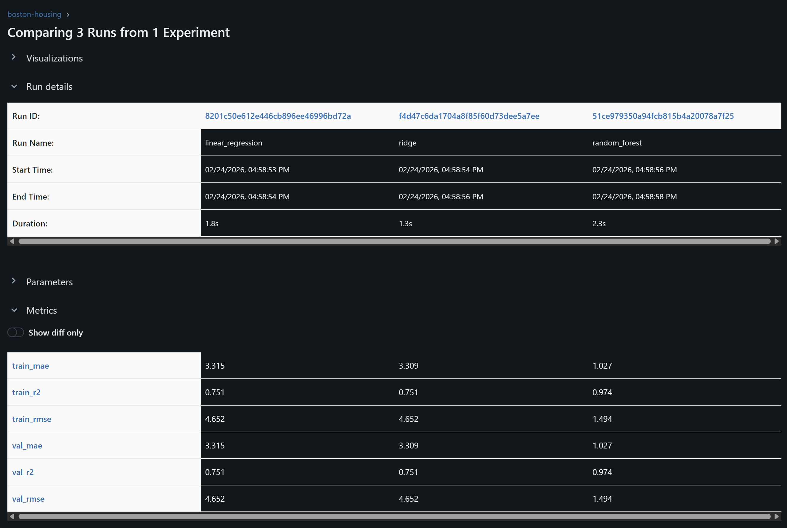
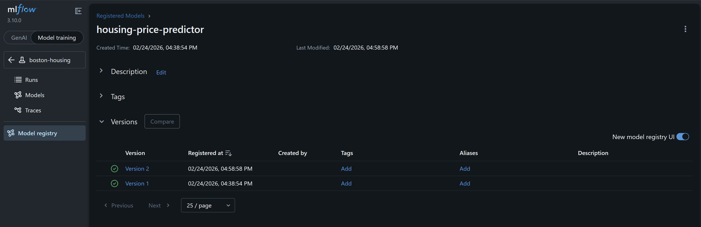
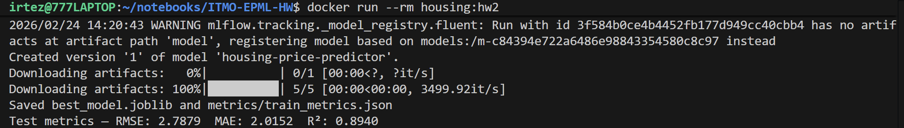

# ДЗ 2 - Версионирование данных и моделей

## Введение

В рамках данного задания настроены два инструмента:
- **DVC** (Data Version Control) - версионирование данных и автоматизация ML-пайплайна
- **MLflow** - трекинг экспериментов и Model Registry для версионирования моделей

Датасет: Boston Housing (506 строк x 14 признаков, целевая переменная `medv`).

---

## 1. DVC - Версионирование данных

### 1.1 Установка и инициализация

```bash
poetry add dvc
poetry run dvc init
poetry run dvc remote add -d localremote ~/dvc-storage
```

После `dvc init` в репозитории появляются:
- `.dvc/config` - конфигурация с указанием remote-хранилища
- `.dvcignore` - аналог `.gitignore` для DVC

Конфигурация `.dvc/config`:
```ini
[core]
    remote = localremote
['remote "localremote"']
    url = /home/irtez/dvc-storage
```



### 1.2 Перенос данных под управление DVC

Файл `data/raw/housing.csv` был удалён из git-отслеживания и добавлен в DVC:

```bash
git rm --cached data/raw/housing.csv
poetry run dvc add data/raw/housing.csv
poetry run dvc push
```

DVC создаёт файл-указатель `data/raw/housing.csv.dvc`:
```yaml
outs:
- md5: <hash>
  size: 49082
  path: housing.csv
```

Теперь в git хранится только лёгкий указатель, а сам файл - в remote-хранилище.



### 1.3 Автоматический пайплайн

Для автоматического создания версий настроен пайплайн в `dvc.yaml` из трёх стадий:

```
data/raw/housing.csv.dvc
           │
           ▼
        prepare          data/processed/train.csv
           │             data/processed/test.csv
           ▼
         train           models/best_model.joblib
           │             metrics/train_metrics.json
           ▼
        evaluate         metrics/test_metrics.json
```

Параметры пайплайна вынесены в `params.yaml`:
```yaml
prepare:
  test_size: 0.2
  random_state: 42

train:
  random_state: 42
  models:
    ridge:
      alpha: 1.0
    random_forest:
      n_estimators: 100
      max_depth: 10
```

Запуск пайплайна:
```bash
poetry run dvc repro
```




### 1.4 Метрики

```bash
poetry run dvc metrics show
```

Результаты:

| Метрика | Значение |
|---------|----------|
| Лучшая модель (train) | random_forest |
| Train RMSE (best) | 1.4936 |
| Test RMSE | 2.7879 |
| Test MAE | 2.0152 |
| Test R² | 0.8940 |



(метрики в терминале немного поехали)

При изменении параметров (например, `alpha: 0.5`) достаточно запустить `dvc repro` - пайплайн пересчитает только затронутые стадии. Сравнение версий:
```bash
dvc metrics diff HEAD~1
```

---

## 2. MLflow - Версионирование моделей

### 2.1 Установка и конфигурация

```bash
poetry add mlflow
```

MLflow настроен на файловое хранение (`file:./mlruns`) без отдельного сервера:
```python
mlflow.set_tracking_uri("file:./mlruns")
mlflow.set_experiment("boston-housing")
```

Директория `mlruns/` добавлена в `.gitignore`.

### 2.2 Трекинг экспериментов

В рамках одного `dvc repro` обучаются три модели, каждая логируется в MLflow:

| Модель | Train RMSE | Val RMSE | Train R² |
|--------|-----------|----------|----------|
| random_forest | 1.4936 | 1.4936 | 0.9743 |
| linear_regression | 4.6520 | 4.6520 | 0.7509 |
| ridge | 4.6522 | 4.6522 | 0.7509 |

Для каждого запуска MLflow логирует:
- **Параметры**: `model_type`, гиперпараметры из `params.yaml`
- **Метрики**: `train_rmse`, `train_mae`, `train_r2`, `val_rmse`, `val_mae`, `val_r2`
- **Артефакт**: сериализованный sklearn-пайплайн (StandardScaler + модель)

### MLflow UI

Интерфейс MLflow запускается командой:

```bash
cd /path/to/ITMO-EPML-HW
poetry run mlflow ui --backend-store-uri file:./mlruns --port 5000
```





### 2.3 Model Registry

Лучшая модель автоматически регистрируется:

```python
mlflow.register_model(model_uri=f"runs:/{best_run_id}/model",
                      name="housing-price-predictor")
```

Результат:
```
Registered model: housing-price-predictor
  Version 1: status=READY, run_id=8e117d4a...
```

При каждом новом запуске пайплайна создаётся новая версия модели (v2, v3, …), что обеспечивает полный аудит истории моделей.



### 2.4 Сравнение версий моделей

Для сравнения можно запросить MLflow напрямую:

```python
import mlflow
mlflow.set_tracking_uri("file:./mlruns")
client = mlflow.tracking.MlflowClient()
exp = client.get_experiment_by_name("boston-housing")
runs = client.search_runs(
    experiment_ids=[exp.experiment_id],
    order_by=["metrics.val_rmse ASC"]
)
```

Либо через DVC при сравнении версий параметров:
```bash
dvc params diff HEAD~1
dvc metrics diff HEAD~1
```

---

## 3. Воспроизводимость

### 3.1 Фиксация зависимостей

Точные версии всех пакетов зафиксированы в `poetry.lock`. Любой участник команды получает идентичное окружение:
```bash
poetry install
```

### 3.2 Полная инструкция по воспроизведению

```bash
# 1. Клонировать репозиторий
git clone <repo-url>
cd ITMO-EPML-HW

# 2. Установить зависимости
export PATH="$HOME/.local/bin:$PATH"
poetry config virtualenvs.in-project true
poetry install

# 3. Подключить DVC remote (локальное хранилище)
poetry run dvc remote add -d localremote ~/dvc-storage

# 4. Загрузить данные из DVC remote
poetry run dvc pull

# 5. Запустить пайплайн
poetry run dvc repro

# 6. Проверить результаты
poetry run dvc metrics show
poetry run pytest
```

### 3.3 Идемпотентность пайплайна

DVC отслеживает изменения зависимостей по хэшам. При повторном запуске `dvc repro` без изменений все стадии будут пропущены:
```
'data/raw/housing.csv.dvc' didn't change, skipping
Stage 'prepare' didn't change, skipping
Stage 'train' didn't change, skipping
Stage 'evaluate' didn't change, skipping
```

---

## 4. Docker

### 4.1 Обновлённый Dockerfile

Контейнер обновлён для поддержки ML-пайплайна:
- Добавлены `scripts/`, `params.yaml`, `dvc.yaml`
- `data/raw/housing.csv` копируется явно (DVC-managed файл включён в образ)
- `MLFLOW_TRACKING_URI` задаёт локальное хранилище MLflow
- CMD изменён на `python scripts/train.py`

### 4.2 Сборка и запуск

```bash
docker build -t housing:hw2 .
docker run --rm housing:hw2
```



---

## 5. Структура новых файлов

```
ITMO-EPML-HW/
├── .dvc/
│   └── config                    # DVC remote: ~/dvc-storage
├── .dvcignore
├── data/raw/housing.csv.dvc      # Указатель DVC (вместо самого файла в git)
├── dvc.yaml                      # Пайплайн: prepare → train → evaluate
├── dvc.lock                      # Зафиксированные хэши выходов стадий
├── params.yaml                   # Гиперпараметры для всех стадий
├── metrics/
│   ├── train_metrics.json        # Метрики обучения (best model + all models)
│   └── test_metrics.json         # Метрики на тестовой выборке
├── scripts/
│   ├── prepare.py                # Стадия 1: raw → train/test split
│   ├── train.py                  # Стадия 2: обучение 3 моделей + MLflow + registry
│   └── evaluate.py               # Стадия 3: оценка на test set
├── src/housing/
│   ├── features/build.py         # Feature engineering (StandardScaler pipeline)
│   └── models/train.py           # compute_metrics, train_and_log_model
└── tests/
    ├── conftest.py               # Фикстура tiny_df (20 синтетических строк)
    ├── test_features.py          # 17 тестов для features/build.py
    └── test_models.py            # 5 тестов для models/train.py (чистые функции)
```

---

**Команды для запуска из директории проекта:**
```bash
cd ~/notebooks/ITMO-EPML-HW
source .venv/bin/activate   # или: export PATH="$HOME/.local/bin:$PATH"
```
