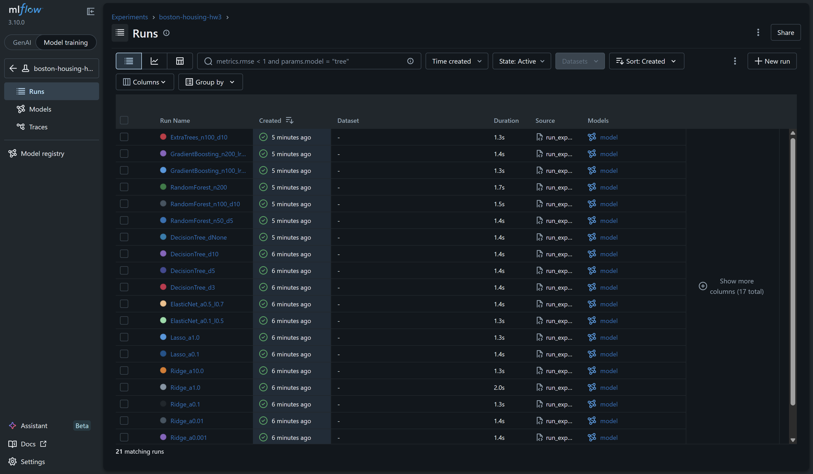
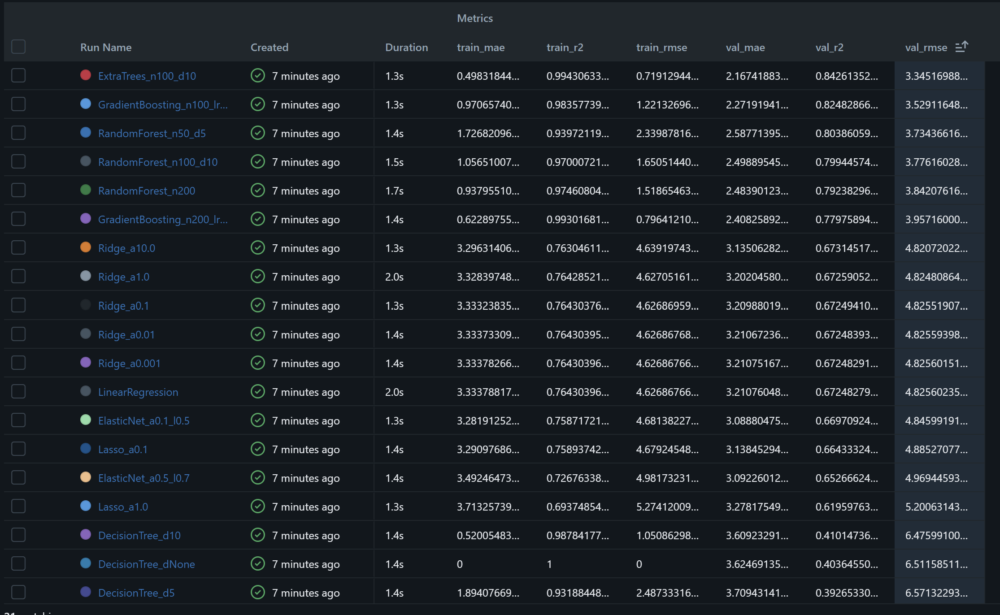
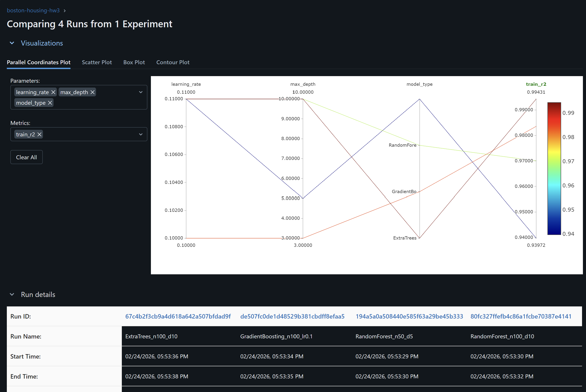
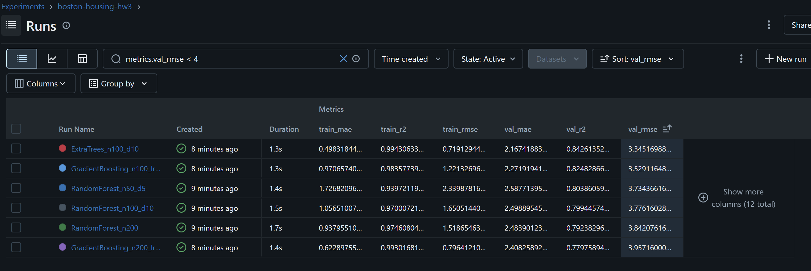
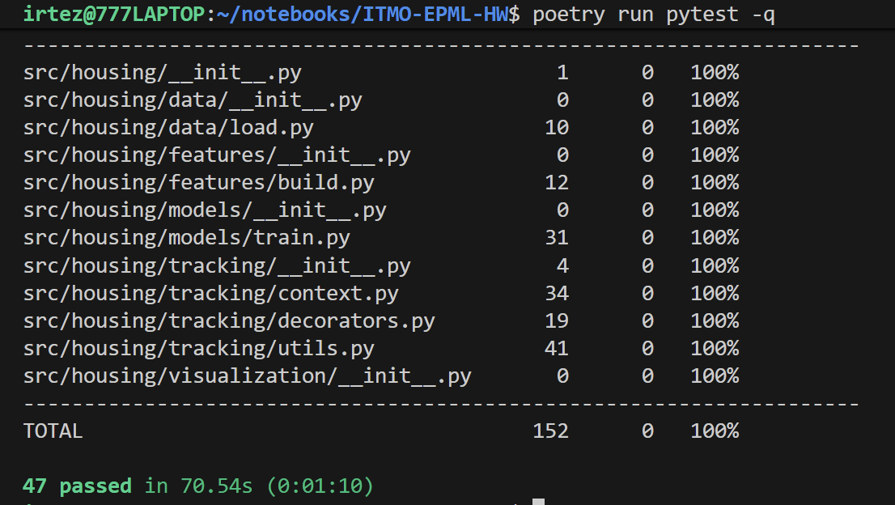

# ДЗ 3 — Трекинг экспериментов

## Выбранный инструмент

**MLflow** (уже использовался в ДЗ 2).

Обоснование:
- уже установлен и настроен (`pyproject.toml`)
- богатый UI с таблицами, графиками, сравнением запусков и Model Registry
- Python API покрывает все требования: логирование параметров, метрик, артефактов, поиск и фильтрация

---

## 1. Настройка инструмента

### 1.1 Установка и конфигурация (ДЗ 2)

MLflow добавлен в ДЗ 2 как обычная зависимость Poetry:

```toml
# pyproject.toml
[tool.poetry.dependencies]
mlflow = "^3.10.0"
```

Трекинг-URI задаётся программно перед первым вызовом MLflow:

```python
mlflow.set_tracking_uri("sqlite:///mlflow.db")
```

Файл `mlflow.db` добавлен в `.gitignore`.

### 1.2 Проекты (эксперименты)

В ДЗ 2 создан эксперимент **`boston-housing`** — 3 запуска (LinearRegression, Ridge, RandomForest).

В ДЗ 3 добавлен отдельный эксперимент **`boston-housing-hw3`** — 21 запуск.

Имена экспериментов задаются через `mlflow.set_experiment(...)`, создаются автоматически при первом вызове.

### 1.3 Запуск MLflow UI

```bash
poetry run mlflow ui --backend-store-uri sqlite:///mlflow.db --port 5000
```



---

## 2. Проведение экспериментов

### 2.1 Скрипт `scripts/run_experiments.py`

Запускает **21 эксперимент** в проекте `boston-housing-hw3`:

| # | Алгоритм | Семейство | Ключевые гиперпараметры |
|---|----------|-----------|-------------------------|
| 0 | DummyMean (baseline) | baseline | — |
| 1 | LinearRegression | linear | — |
| 2 | Ridge | linear | alpha=0.001 |
| 3 | Ridge | linear | alpha=0.01 |
| 4 | Ridge | linear | alpha=0.1 |
| 5 | Ridge | linear | alpha=1.0 |
| 6 | Ridge | linear | alpha=10.0 |
| 7 | Lasso | linear | alpha=0.1 |
| 8 | Lasso | linear | alpha=1.0 |
| 9 | ElasticNet | linear | alpha=0.1, l1\_ratio=0.5 |
| 10 | ElasticNet | linear | alpha=0.5, l1\_ratio=0.7 |
| 11 | DecisionTree | tree | max\_depth=3 |
| 12 | DecisionTree | tree | max\_depth=5 |
| 13 | DecisionTree | tree | max\_depth=10 |
| 14 | DecisionTree | tree | max\_depth=None |
| 15 | RandomForest | ensemble | n=50, d=5 |
| 16 | RandomForest | ensemble | n=100, d=10 |
| 17 | RandomForest | ensemble | n=200, d=None |
| 18 | GradientBoosting | ensemble | n=100, lr=0.1, d=3 |
| 19 | GradientBoosting | ensemble | n=200, lr=0.05, d=4 |
| 20 | ExtraTrees | ensemble | n=100, d=10 |

Данные: `data/processed/train.csv` делится на 80 % train / 20 % val (stratify-free split, seed=42).

Запуск:
```bash
poetry run dvc repro prepare   # создать train.csv
poetry run python scripts/run_experiments.py
```

### 2.2 Логирование метрик и параметров

Для каждого запуска логируются:

| Тип | Ключи |
|-----|-------|
| Параметры | `model_type`, все гиперпараметры модели |
| Теги | `family` (linear / tree / ensemble / baseline), `hw` = "hw3" |
| Метрики | `train_rmse`, `train_mae`, `train_r2`, `val_rmse`, `val_mae`, `val_r2` |
| Артефакт | полный sklearn Pipeline (`model/`) |

### 2.3 Результаты экспериментов

Таблица отсортирована по `val_rmse` ↑:

| run\_name | model\_type | val\_rmse | val\_mae | val\_r2 | train\_rmse | train\_r2 |
|-----------|-------------|-----------|----------|---------|-------------|-----------|
| ExtraTrees\_n100\_d10 | ExtraTrees | **3.345** | 2.167 | **0.843** | 0.719 | 0.994 |
| GradientBoosting\_n100\_lr0.1 | GradientBoosting | 3.529 | 2.272 | 0.825 | 1.221 | 0.984 |
| RandomForest\_n50\_d5 | RandomForest | 3.734 | 2.588 | 0.804 | 2.340 | 0.940 |
| RandomForest\_n100\_d10 | RandomForest | 3.776 | 2.499 | 0.799 | 1.651 | 0.970 |
| RandomForest\_n200 | RandomForest | 3.842 | 2.484 | 0.792 | 1.519 | 0.975 |
| GradientBoosting\_n200\_lr0.05 | GradientBoosting | 3.957 | 2.408 | 0.780 | 0.796 | 0.993 |
| Ridge\_a10.0 | Ridge | 4.821 | 3.135 | 0.673 | 4.639 | 0.763 |
| Ridge\_a1.0 | Ridge | 4.825 | 3.202 | 0.673 | 4.627 | 0.764 |
| LinearRegression | LinearRegression | 4.826 | 3.211 | 0.673 | 4.627 | 0.764 |
| Lasso\_a0.1 | Lasso | 4.885 | 3.139 | 0.664 | 4.679 | 0.759 |
| ElasticNet\_a0.1\_l0.5 | ElasticNet | 4.846 | 3.089 | 0.670 | 4.681 | 0.759 |
| Lasso\_a1.0 | Lasso | 5.201 | 3.278 | 0.620 | 5.274 | 0.694 |
| DecisionTree\_d10 | DecisionTree | 6.476 | 3.609 | 0.410 | 1.051 | 0.988 |
| DecisionTree\_dNone | DecisionTree | 6.512 | 3.625 | 0.404 | 0.000 | 1.000 |
| DecisionTree\_d5 | DecisionTree | 6.571 | 3.709 | 0.393 | 2.487 | 0.932 |
| DecisionTree\_d3 | DecisionTree | 6.628 | 3.825 | 0.382 | 3.877 | 0.835 |
| DummyMean\_baseline | DummyMean | 8.432 | 6.415 | −0.000 | 8.432 | −0.000 |

**Лучшая модель:** `ExtraTrees_n100_d10` (val\_rmse=3.345, val\_r2=0.843).



### 2.4 Сравнение экспериментов

В MLflow UI доступен встроенный инструмент сравнения: выбрать несколько запусков → "Compare".



### 2.5 Фильтрация и поиск

Через `search_runs()` можно фильтровать запуски по произвольным условиям:

```python
from housing.tracking import search_runs

# Только модели с val_r2 > 0.80
df = search_runs("boston-housing-hw3", filter_string="metrics.val_r2 > 0.80")
```

В MLflow UI фильтрация доступна через поле "Search runs" (синтаксис `metrics.val_rmse < 4`).



---

## 3. Интеграция с кодом

### 3.1 Модуль `src/housing/tracking/`

Добавлен новый подпакет с тремя абстракциями поверх MLflow:

```
src/housing/tracking/
├── __init__.py       # Реэкспорт публичного API
├── decorators.py     # @mlflow_run — декоратор
├── context.py        # ExperimentTracker — контекстный менеджер
└── utils.py          # compare_runs, get_best_run, search_runs
```

### 3.2 Декоратор `@mlflow_run`

Оборачивает функцию в MLflow run — полезно для небольших экспериментальных функций.

```python
from housing.tracking import mlflow_run

@mlflow_run(
    experiment_name="boston-housing-hw3",
    run_name="DummyMean_baseline",
    tags={"family": "baseline", "hw": "hw3"},
)
def log_baseline(y_train: pd.Series, y_val: pd.Series) -> None:
    baseline_pred = np.full(len(y_val), float(y_train.mean()))
    metrics = compute_metrics(y_val, baseline_pred)
    mlflow.log_param("model_type", "DummyMean")
    mlflow.log_metrics({f"val_{k}": v for k, v in metrics.items()})
```

Декоратор:
- принимает `experiment_name`, `run_name`, `tags`
- прозрачен для сигнатуры функции (использует `functools.wraps` + `ParamSpec`)
- корректно закрывает run при исключении

### 3.3 Контекстный менеджер `ExperimentTracker`

Подходит для более длинных блоков — обучение модели, пошаговое логирование.

```python
from housing.tracking import ExperimentTracker

with ExperimentTracker(
    experiment_name="boston-housing-hw3",
    run_name="ExtraTrees_n100_d10",
    tags={"family": "ensemble", "hw": "hw3"},
) as tracker:
    tracker.log_param("model_type", "ExtraTrees_n100_d10")
    tracker.log_params({"n_estimators": 100, "max_depth": 10})

    pipeline.fit(X_train, y_train)

    tracker.log_metrics({f"train_{k}": v for k, v in train_metrics.items()})
    tracker.log_metrics({f"val_{k}": v for k, v in val_metrics.items()})

    mlflow.sklearn.log_model(pipeline, artifact_path="model")

    print(f"run_id: {tracker.run_id}")
```

Методы: `log_param`, `log_params`, `log_metric`, `log_metrics`, `set_tag`, `.run_id`.

### 3.4 Утилиты

```python
from housing.tracking import compare_runs, get_best_run, search_runs

# Сравнение всех запусков в эксперименте → pd.DataFrame
df = compare_runs("boston-housing-hw3")

# Лучший запуск по метрике
best = get_best_run("boston-housing-hw3", metric="val_rmse", mode="min")
print(best.info.run_name, best.data.metrics["val_rmse"])

# Поиск с фильтром
df = search_runs(
    "boston-housing-hw3",
    filter_string="metrics.val_r2 > 0.80",
    order_by=["metrics.val_rmse ASC"],
)
```

### 3.5 Использование в `scripts/run_experiments.py`

Скрипт демонстрирует все три паттерна:

1. **Декоратор** → `log_baseline()` (baseline-запуск)
2. **Контекстный менеджер** → `run_one_experiment()` (каждая реальная модель)
3. **Утилиты** → итоговая таблица `compare_runs()`, фильтрация `search_runs()`, `get_best_run()`

---

## 4. Тесты

Файл `tests/test_tracking.py` — 20 тестов в трёх классах:

| Класс | Тестирует | Кол-во |
|-------|-----------|--------|
| `TestMlflowRunDecorator` | декоратор | 5 |
| `TestExperimentTracker` | контекстный менеджер | 7 |
| `TestUtils` | утилиты | 8 |

Каждый тест изолирован фикстурой `_isolated_mlflow` — MLflow указывает на временную SQLite БД `tmp_path/mlflow.db`.

```bash
poetry run pytest
```

Покрытие: **100 %**.



---

## 5. Воспроизведение

```bash
# Клонировать и установить зависимости
git clone <repo>
cd ITMO-EPML-HW
poetry install

# Получить данные из DVC remote
poetry run dvc pull

# Запустить DVC пайплайн (prepare → train → evaluate)
poetry run dvc repro

# Запустить серию HW3-экспериментов (21 запуск)
poetry run python scripts/run_experiments.py

# Открыть MLflow UI
poetry run mlflow ui --backend-store-uri sqlite:///mlflow.db --port 5000

# Тесты
poetry run pytest
```
