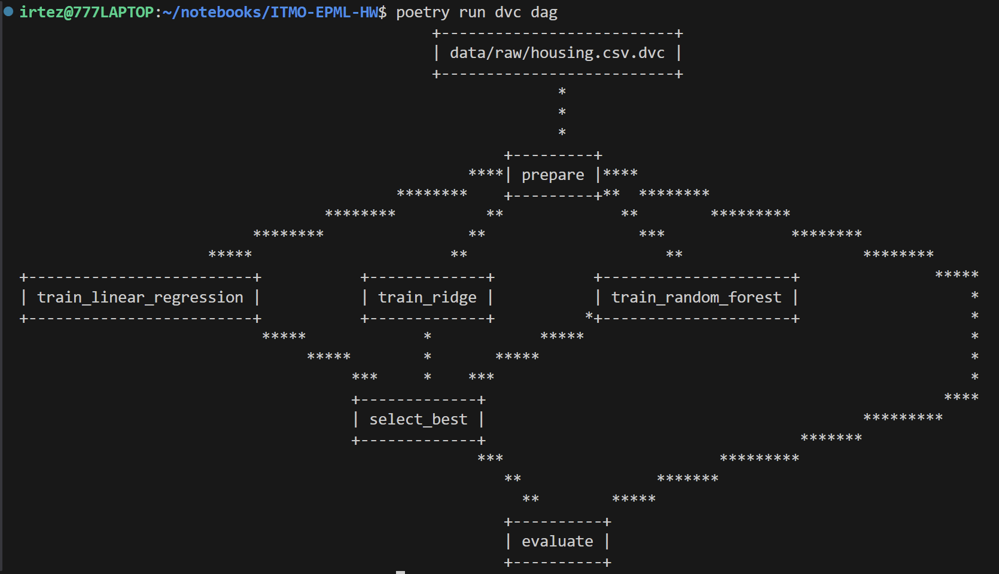
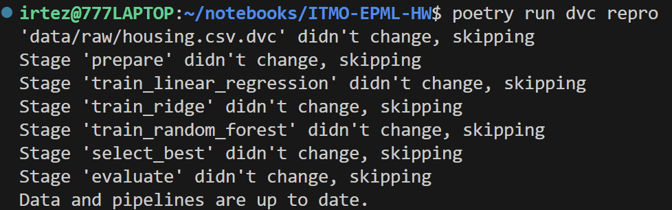
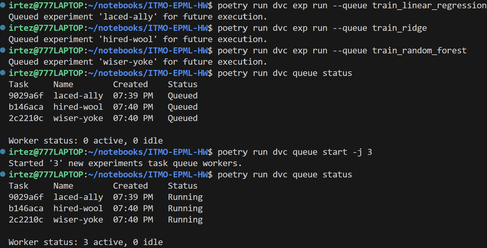
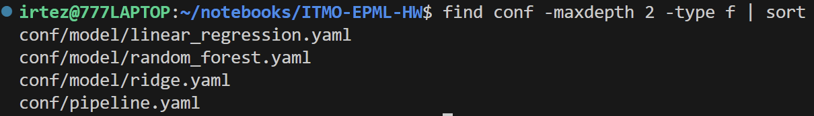
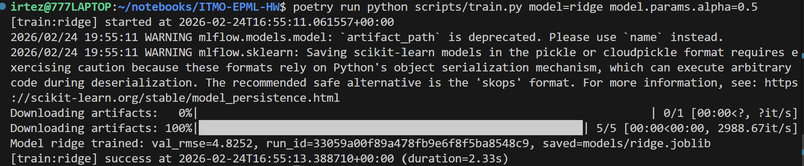
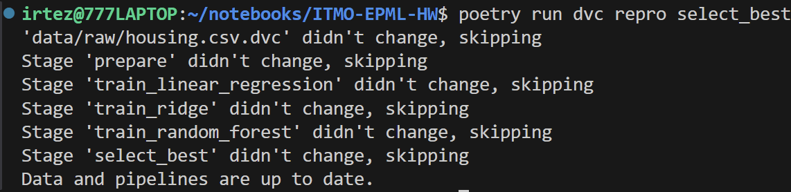
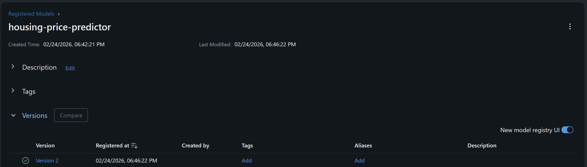
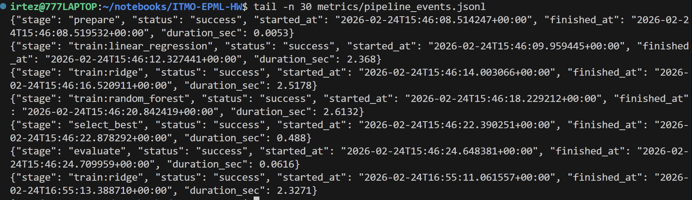
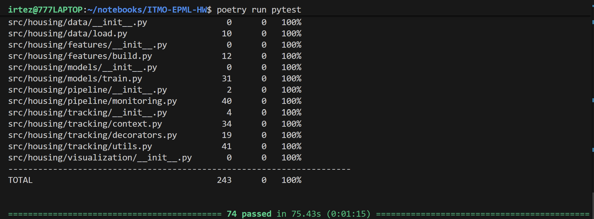

# ДЗ 4 - Автоматизация ML пайплайнов

## Выбранные инструменты

- Оркестрация: **DVC Pipelines**
- Управление конфигурациями: **Hydra**

Обоснование выбора:
- DVC уже использовался в проекте и покрывает оркестрацию, кэш и воспроизводимость.
- Hydra удобно интегрируется в Python-скрипты и дает композицию конфигураций через `defaults` и override'ы.

---

## 1. Настройка инструмента оркестрации (DVC)

### 1.1 Workflow ML-пайплайна

В `dvc.yaml` настроен пайплайн из 6 стадий:

1. `prepare`
2. `train_linear_regression`
3. `train_ridge`
4. `train_random_forest`
5. `select_best`
6. `evaluate`

Граф зависимостей:

`prepare -> {train_linear_regression, train_ridge, train_random_forest} -> select_best -> evaluate`



### 1.2 Зависимости между этапами

- `prepare` формирует `data/processed/train.csv` и `data/processed/test.csv`
- каждая `train_*` стадия обучает одну модель и пишет:
  - `models/<model>.joblib`
  - `metrics/train_<model>.json`
- `select_best` читает метрики трех моделей, выбирает лучшую по `val_rmse`, копирует артефакт в `models/best_model.joblib`, формирует агрегированные метрики `metrics/train_metrics.json` и регистрирует модель в MLflow Registry
- `evaluate` оценивает лучшую модель на test и пишет `metrics/test_metrics.json`

### 1.3 Кэширование и параллельное выполнение

- Кэширование: встроено в DVC (`dvc repro` пропускает неизмененные стадии).
- Параллельность: для параллельного запуска используется очередь экспериментов DVC.

Команда:

```bash
poetry run dvc exp run --queue train_linear_regression
poetry run dvc exp run --queue train_ridge
poetry run dvc exp run --queue train_random_forest
poetry run dvc queue start -j 3
```





---

## 2. Настройка инструмента конфигураций (Hydra)

### 2.1 Структура конфигов

Добавлены конфиги:

- `conf/pipeline.yaml` - базовый конфиг пайплайна
- `conf/model/linear_regression.yaml`
- `conf/model/ridge.yaml`
- `conf/model/random_forest.yaml`

Композиция настроена через:

```yaml
defaults:
  - _self_
  - model: linear_regression
```



### 2.2 Конфигурации для разных алгоритмов

Алгоритм выбирается override-ом:

```bash
poetry run python scripts/train.py model=linear_regression
poetry run python scripts/train.py model=ridge
poetry run python scripts/train.py model=random_forest
```

### 2.3 Валидация конфигураций

Реализована в `src/housing/config/validation.py`:

- проверка диапазонов: `test_size`, `val_size` в `(0, 1)`
- проверка `random_state >= 0`
- проверка поддерживаемых моделей
- проверка гиперпараметров (`alpha > 0`, `n_estimators >= 1`, `max_depth >= 1`)

### 2.4 Система композиции конфигураций

- базовый конфиг + групповая конфигурация модели (`model=<name>`)
- точечные override'ы отдельных параметров CLI, например:

```bash
poetry run python scripts/train.py model=ridge model.params.alpha=0.5
```



---

## 3. Интеграция и тестирование

### 3.1 Интеграция DVC + Hydra

Каждая стадия DVC запускает Python-скрипт, который получает единый Hydra-конфиг:

- `scripts/prepare.py`
- `scripts/train.py`
- `scripts/select_best.py`
- `scripts/evaluate.py`





### 3.2 Мониторинг выполнения

Добавлен модуль `src/housing/pipeline/monitoring.py`:

- `monitored_stage(...)` - фиксирует start/end/status/duration
- события пишутся в `metrics/pipeline_events.jsonl`



### 3.3 Уведомления о результатах

Уведомления настроены в `conf/pipeline.yaml`:

- `monitoring.notifications.console: true`
- `monitoring.notifications.file: true`
- `monitoring.notifications.file_path: reports/pipeline_notifications.log`

Для каждой стадии записываются уведомления `started/success/failed`.


### 3.4 Тестирование воспроизводимости

Добавлены тесты:

- `tests/test_config_validation.py`
  - композиция Hydra-конфигов
  - проверка валидаторов
- `tests/test_pipeline_monitoring.py`
  - запись событий и уведомлений
- `tests/test_reproducibility.py`
  - детерминированность RMSE для RandomForest при фиксированном seed

Запуск:

```bash
poetry run pytest
```

Результат после исправлений:

- пройдено **74 теста**
- итоговое покрытие пакета `src/housing` — **100%**



---

## 4. Воспроизведение

```bash
# 1) Установка зависимостей
poetry install

# 2) Получение данных
poetry run dvc pull

# 3) Запуск автоматизированного пайплайна
poetry run dvc repro

# 4) Пример параллельного выполнения экспериментов
poetry run dvc exp run --queue train_linear_regression
poetry run dvc exp run --queue train_ridge
poetry run dvc exp run --queue train_random_forest
poetry run dvc queue start -j 3

# 5) Проверка метрик
poetry run dvc metrics show

# 6) Проверка тестов
poetry run pytest

# 7) UI MLflow
poetry run mlflow ui --backend-store-uri sqlite:///mlflow.db --port 5000
```
