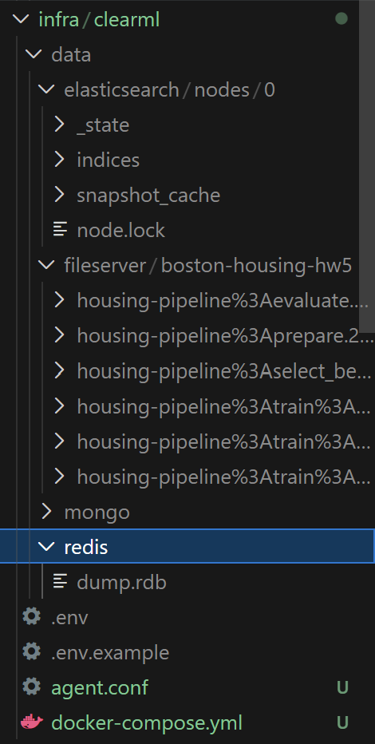
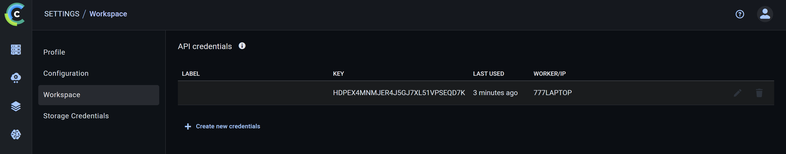
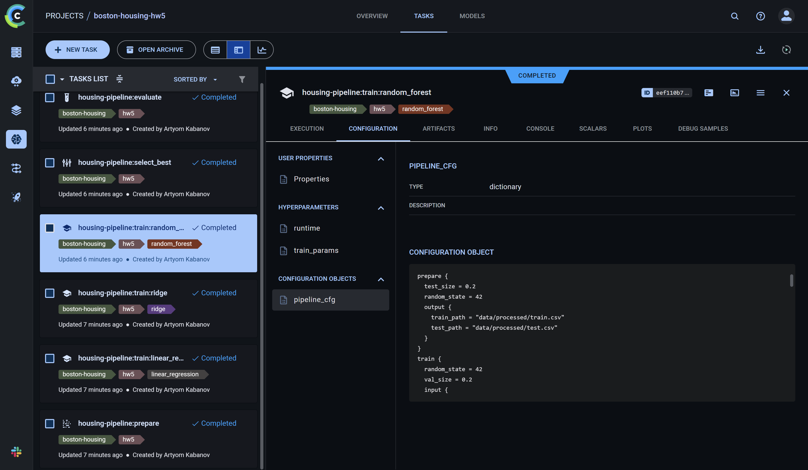
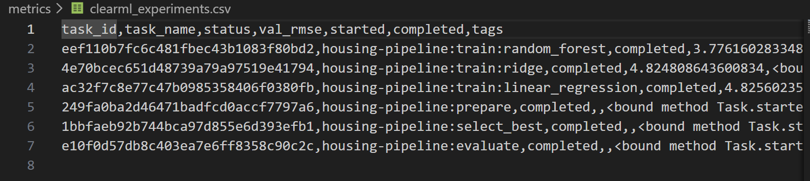
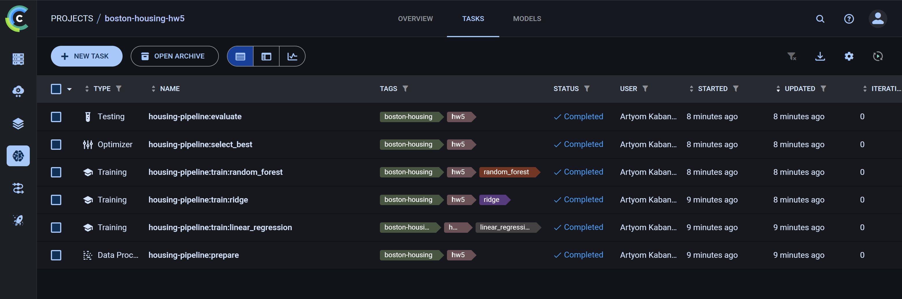
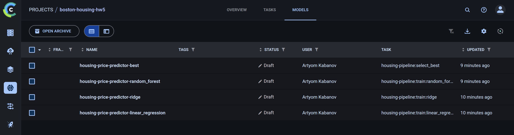
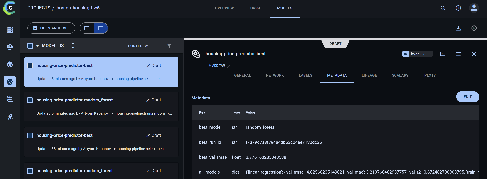
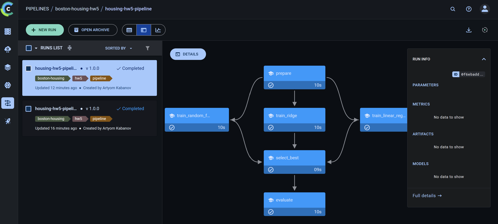
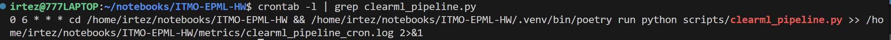
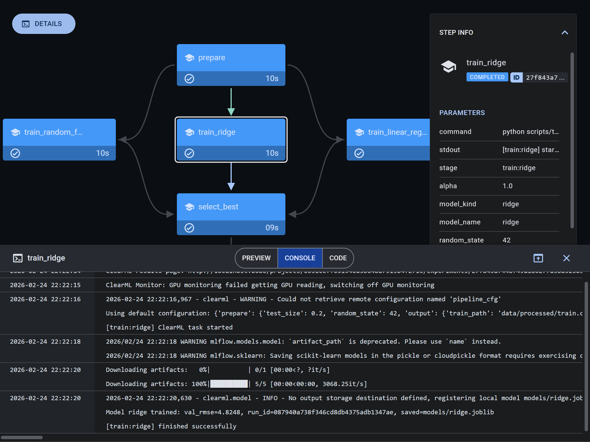

# ДЗ 5 - ClearML для MLOps

## Цель

Интегрировать ClearML в текущий ML workflow (DVC + Hydra + MLflow) для:

- централизованного трекинга экспериментов,
- регистрации и версионирования моделей,
- управления пайплайнами,
- мониторинга выполнения и отчетности.

---

## 1. Настройка ClearML

### 1.1 Развертывание ClearML Server

Для инфраструктуры добавлен файл:

- `infra/clearml/docker-compose.yml`

Запускаемые сервисы:

- `mongo` (БД)
- `redis` (очереди/кэш)
- `elasticsearch` (индексы и поиск)
- `apiserver` (API)
- `webserver` (UI)
- `fileserver` (хранилище артефактов)
- `clearml-agent` (выполнение задач из очередей)

Команды:

```bash
cd infra/clearml
cp .env.example .env
docker compose up -d
# Агент запускается отдельно (после настройки валидных ключей в .env):
docker compose --profile agent up -d clearml-agent
```


### 1.2 База данных и хранилище

Настроены volume'ы:

- `infra/clearml/data/mongo`
- `infra/clearml/data/redis`
- `infra/clearml/data/elasticsearch`
- `infra/clearml/data/fileserver`

Это обеспечивает сохранность метаданных и артефактов между перезапусками контейнеров.



### 1.3 Аутентификация

Добавлен шаблон клиентского конфига:

- `conf/clearml/clearml.conf.example`

Используются переменные окружения:

- `CLEARML_API_ACCESS_KEY`
- `CLEARML_API_SECRET_KEY`

Подготовка клиента:

```bash
cp conf/clearml/clearml.conf.example clearml.conf
export CLEARML_API_ACCESS_KEY=<key>
export CLEARML_API_SECRET_KEY=<secret>
export CLEARML_CONFIG_FILE=$PWD/clearml.conf
```



---

## 2. Трекинг экспериментов

### 2.1 Автоматическое логирование

Добавлен модуль:

- `src/housing/tracking/clearml.py`

Ключевые возможности:

- контекст `ClearMLTracker` для автоматического lifecycle задачи,
- логирование параметров и scalar-метрик,
- загрузка артефактов,
- регистрация модели в ClearML Registry.

Интеграция выполнена в стадиях:

- `scripts/prepare.py`
- `scripts/train.py`
- `scripts/select_best.py`
- `scripts/evaluate.py`

Запуск стадии с ClearML:

```bash
poetry run python scripts/train.py model=random_forest
```



### 2.2 Сравнение экспериментов

Реализован скрипт:

- `scripts/clearml_compare.py`

Он формирует таблицы:

- `metrics/clearml_experiments.csv`
- `metrics/clearml_models.csv`

Команда:

```bash
poetry run python scripts/clearml_compare.py
```



### 2.3 Метрики и параметры

В `train/select/evaluate` логируются:

- параметры (`train_params`, `selection`, и т.д.),
- train/val/test метрики,
- артефакты `*.json`, `*.joblib`.


### 2.4 Дашборды

В ClearML UI используются стандартные вкладки:

- `Scalars` (динамика метрик)
- `Configuration` (параметры)
- `Artifacts/Models` (артефакты и версии моделей)



---

## 3. Управление моделями

### 3.1 Регистрация и версионирование

На стадиях `train` и `select_best` выполняется регистрация моделей:

- `model_name = <base>-<algorithm>`
- `model_name = <base>-best`

Каждый новый запуск создаёт новую версию модели в Registry.



### 3.2 Метаданные моделей

При регистрации прикладываются метаданные (metrics summary) и связанные артефакты.



### 3.3 Сравнение моделей

Скрипт `scripts/clearml_compare.py` строит отдельную таблицу по моделям (`clearml_models.csv`) для анализа версий и сравнения артефактов.


---

## 4. Пайплайны

### 4.1 ClearML Pipeline для ML workflow

Добавлен скрипт:

- `scripts/clearml_pipeline.py`

Собираемый DAG:

- `prepare -> train_linear_regression`
- `prepare -> train_ridge`
- `prepare -> train_random_forest`
- `train_* -> select_best -> evaluate`

Команда запуска:

```bash
poetry run python scripts/clearml_pipeline.py
```



### 4.2 Автоматический запуск

В конфиг добавлены параметры автозапуска:

- `clearml.pipeline.execution_queue`
- `clearml.pipeline.schedule_cron`

В текущем решении автозапуск выполняется через внешний `cron`.

Скрипт сохраняет файл:

- `metrics/clearml_pipeline_schedule.txt`

где фиксируется cron-выражение из конфига.

Пример настройки в `crontab`:

```bash
(crontab -l 2>/dev/null; echo "0 6 * * * cd /home/irtez/notebooks/ITMO-EPML-HW && /home/irtez/notebooks/ITMO-EPML-HW/.venv/bin/poetry run python scripts/clearml_pipeline.py >> /home/irtez/notebooks/ITMO-EPML-HW/metrics/clearml_pipeline_cron.log 2>&1") | crontab -
crontab -l | grep clearml_pipeline.py
```



### 4.3 Мониторинг и уведомления

Используется уже существующий мониторинг стадий:

- `metrics/pipeline_events.jsonl`
- `reports/pipeline_notifications.log`

Плюс ClearML UI показывает статусы и логи задач каждого шага pipeline.



---

## 5. Проверка и воспроизведение

```bash
# 1) Установка зависимостей
poetry install

# 2) Поднять ClearML Server
cd infra/clearml
cp .env.example .env
docker compose up -d
# Агент запускается отдельно (после настройки валидных ключей в .env):
docker compose --profile agent up -d clearml-agent
cd ../..

# 3) Подготовить клиентский конфиг
cp conf/clearml/clearml.conf.example clearml.conf
export CLEARML_API_ACCESS_KEY=<key>
export CLEARML_API_SECRET_KEY=<secret>
export CLEARML_CONFIG_FILE=$PWD/clearml.conf

# 4) Включить ClearML в conf/pipeline.yaml
# clearml.enabled: true

# 5) Запуск пайплайна через DVC
poetry run dvc repro

# 6) Запуск ClearML Pipeline Controller
poetry run python scripts/clearml_pipeline.py

# 7) Экспорт сравнений
poetry run python scripts/clearml_compare.py

# 8) Тесты
poetry run pytest
```
