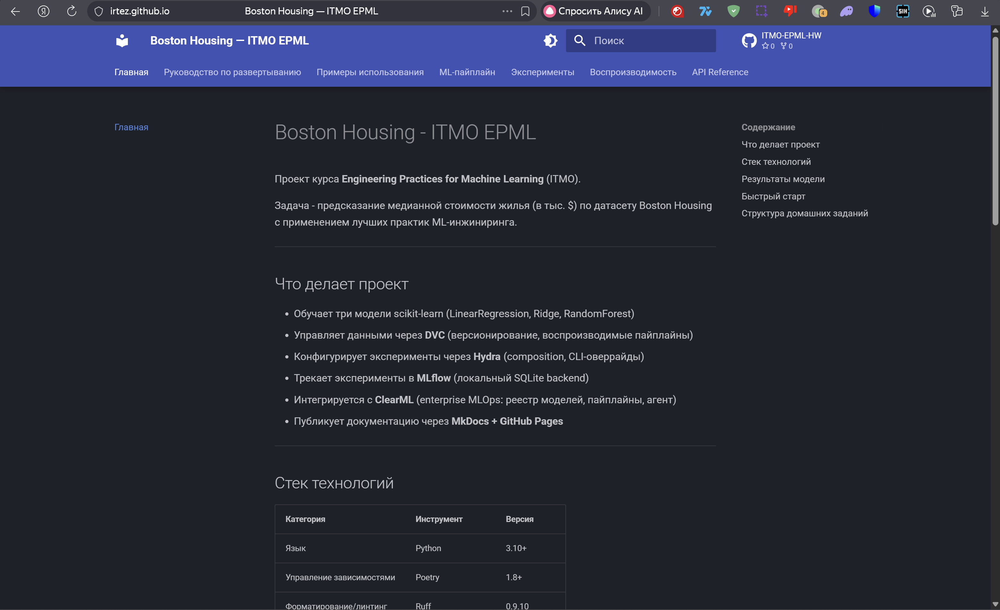
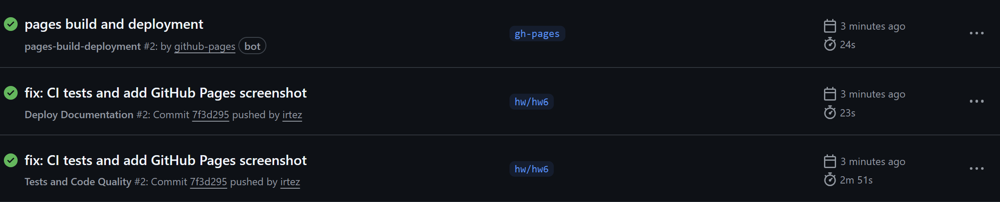
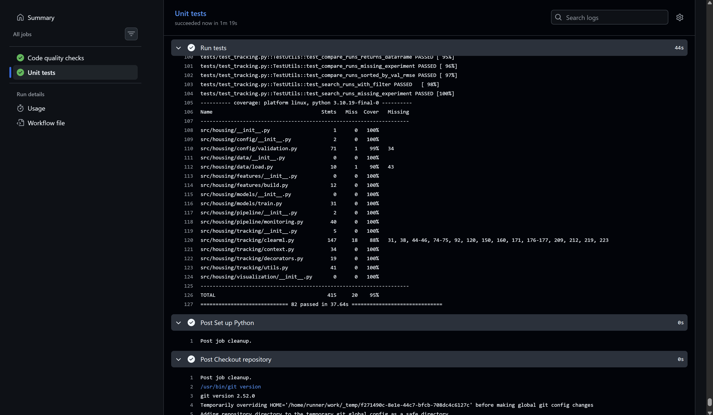
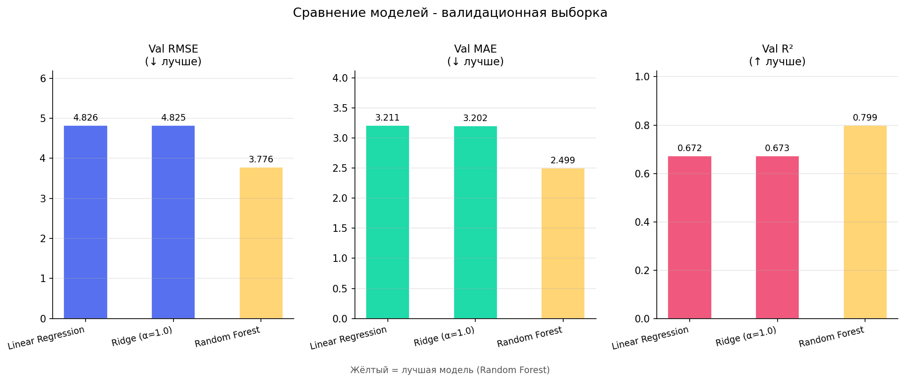
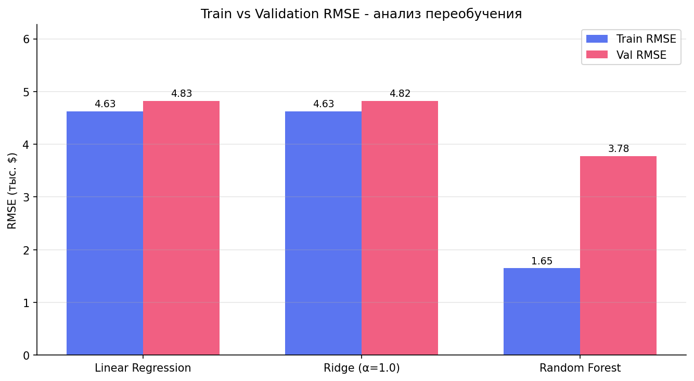
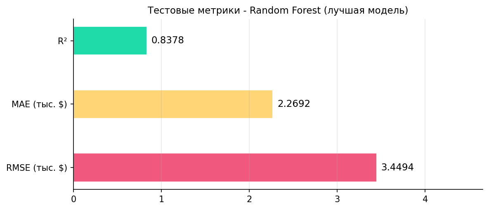
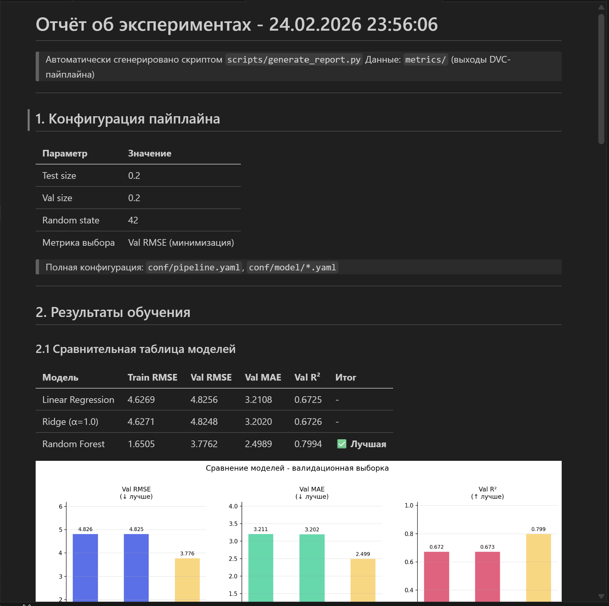

# ДЗ 6 - Документация и отчёты

## 1. Документация

### 1.1. MkDocs

Создан сайт документации с помощью **MkDocs + Material theme**.

Структура:

```
docs/
├── index.md           # Главная страница
├── deployment.md      # Руководство по развертыванию
├── usage.md           # Примеры использования
├── pipeline.md        # ML-пайплайн
├── experiments.md     # Результаты экспериментов
├── reproducibility.md # Воспроизводимость
└── api/               # API Reference
    ├── index.md
    ├── data.md
    ├── features.md
    ├── models.md
    ├── tracking.md
    └── config.md
```

Конфигурация: `mkdocs.yml` (тема Material, расширения Mermaid, подсветка кода).

Локальный запуск:

```bash
pip install mkdocs mkdocs-material
mkdocs serve
```

### 1.2. GitHub Pages

Настроен GitHub Actions workflow (`.github/workflows/docs.yml`):

- Триггер: push в ветку `master`
- Сборка: `mkdocs build --strict`
- Публикация: `mkdocs gh-deploy --force` → ветка `gh-pages`



### 1.3. GitHub Actions CI

Добавлен workflow (`.github/workflows/tests.yml`):

- Code quality: Ruff, MyPy, Bandit
- Unit tests: pytest с coverage
- Триггер: push в `master` и `hw/**`





---

## 2. Автоматическая генерация отчётов об экспериментах

### 2.1. Скрипт генерации

Создан скрипт `scripts/generate_report.py`, который:

- Читает метрики из `metrics/train_*.json`, `metrics/train_metrics.json`, `metrics/test_metrics.json`
- Читает гиперпараметры из конфигов Hydra: `conf/model/*.yaml`
- Генерирует три графика в `reports/experiments/figures/`
- Формирует датированный Markdown-отчёт `reports/experiments/report_YYYY-MM-DD.md`

Запуск:

```bash
poetry run python scripts/generate_report.py
```

Параметры:

```
--out-dir PATH   Папка для отчёта (по умолчанию: reports/experiments)
```

### 2.2. Структура выходных файлов

```
reports/experiments/
├── figures/
│   ├── model_comparison.png   # Сравнение val RMSE / MAE / R² для всех моделей
│   ├── train_val_gap.png      # Train vs Val RMSE - анализ переобучения
│   └── test_metrics.png       # Тестовые метрики лучшей модели
└── report_YYYY-MM-DD.md       # Сгенерированный отчёт
```

### 2.3. Сгенерированные графики

**Сравнение моделей:**



**Train vs Validation RMSE (переобучение):**



**Тестовые метрики лучшей модели:**



### 2.4. Пример сгенерированного отчёта

Имя файла: `reports/experiments/report_YYYY-MM-DD_HH-MM-SS.md` - каждый запуск создаёт новый файл.

Отчёт содержит:

- Конфигурацию пайплайна (test_size, val_size, random_state из `conf/pipeline.yaml`)
- Сравнительную таблицу моделей с метриками train/val
- Таблицу параметров из `conf/model/*.yaml`
- Анализ переобучения с gap-таблицей и автоматической классификацией
- Итоговые показатели: лучшая модель, снижение RMSE, наименьший/наибольший gap

Сгенерированный отчет выглядит вот так (`report_example.md`):



`.gitignore` настроен так, чтобы новые отчеты не отслеживались git'ом. Отслеживается только пример отчета и графики для него.
